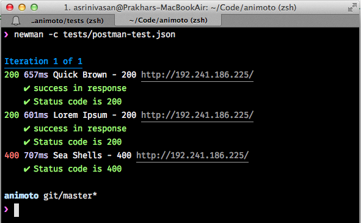

Word Count Validator
===

### Demo

The service is hosted [online](http://192.241.186.225/)

### Build
To run the app on your own machine, you must have `Python 2.7.x` and `pip` installed.
The preferred way of installing the dependancies is using [Virtualenv](http://virtualenv.readthedocs.org/en/latest/virtualenv.html). If you dont have virtualenv, you need to run `sudo make install`.

```shell
$ git clone https://github.com/prakhar1989/WordCounter.git
$ cd WordCounter
$ make install
$ chmod +x run
$ ./run
* Running on http://127.0.0.1:8000/
```

### Routes

| Route        | Description    |
| ------------- |:-------------:|
| GET /     | Return pre-generated random text |
| GET /?random=true | Generate and return random text |
| POST /| Validate request|
| GET /admin | Add new data |

#### Data Format

`GET /` and `GET /?random=true` return a JSON object of the following schema
```javascript
{
  "text": "she sells sea shells at the seashore he sells sea seals at the seashore",
  "token": 846764,
  "words": [ "seashore", "he", "she", "at"]
}
```
where `words` is an array of excluded words.

`POST /` accepts data in `JSON` in the following format
```javascript
{
  "text": "the quick brown fox jumped over the lazy dog", 
  "token": "620770",
  "words": {
    "the": "2",
    "quick": "1",
    "jumped": "1",
    "over": "1",
    "dog": "1"
  }
}
```
and returns a status `200 OK` only iff all the following hold true
- `token` matches the `token` in the response given to the client 
- `text` matches the `text` in the response given to the client
- Word count in the `words` object is correct and **excludes** the words returned in the response given to the client

In all other cases, a status of `400 Bad Request` is returned.

**Note**: Punctuations matter. Hence `fox` and `fox.` are considered two different words.

Below is a sample `cURL` request to `/`
```shell
$ curl -X POST -H "Content-Type:application/json" -d '{
  "text": "the quick brown fox jumped over the lazy dog", 
  "token": "620770",
  "words": {
    "the": "2",
    "quick": "1",
    "jumped": "1",
    "over": "1",
    "dog": "1"
  }
}' http://127.0.0.1:8000/
```


### Tests
The app contains both unit tests and integrations tests. To run simply type the following
```shell
$ ./run -test
```
An additional [Postman](http://getpostman.com) collection has been bundled in `tests/postman-test.json` which can be run the [Newman](https://www.npmjs.org/package/newman) - a node.js test runner that I built for postman. Here's the screenshot below of the output - 


### Structure
```shell
├── Makefile         -> The build script for the project
├── README.md        -> This file
├── app              -> App specific helper python file
├── client.py        -> Sample client implementation
├── requirements.txt -> Python Dependancies
├── run              -> App runner
├── server.py        -> Server implementation
├── templates        -> HTML template for admin
├── tests            -> Integration and unit tests
```
The application uses SQLite for persistence and validation. To setup and seed the db.
```shell
$ ./run -setup
```

### Client
Also included is a sample client implementation that fetches 10 random texts from the server, sends a request and prints the response recieved.
```shell
$ python client.py
Hitting 10 requests ...
Text: the quick brown fox jumped ove... Status Code: 200
Text: Iure omnis consequuntur doloru... Status Code: 200
Text: lorem ipsum dolor set amit dol... Status Code: 200
Text: she sells sea shells at the se... Status Code: 200
Text: she sells sea shells at the se... Status Code: 200
```

### Libraries
The following open-source libraries are used in the project
- [Flask](http://flask.pocoo.org/) - A sinatra like micro web framework for Python
- [Faker](https://github.com/joke2k/faker) - Used for generating fake random text
- [Requests](http://docs.python-requests.org/en/latest/) - Simple HTTP library used for client implementation
